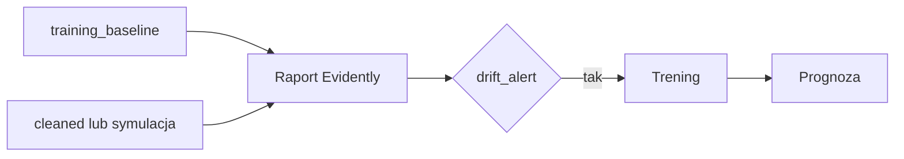

# Propozycja prezentacji projektu

Dokument określa zalecaną kolejność demonstracji modułów systemu. Szacowany czas: około 15–20 minut.

## Założenia

- Aplikacja uruchomiona przez `docker compose up --build`.
- Skonfigurowany plik `.env` z dostępem do Azure (opcjonalnie dla pełnego dashboardu SQL).
- Dostępny plik `job_salary_prediction_dataset.csv` lub pobrane artefakty (`dvc pull`).

## Adresy podczas demonstracji

| Moduł | URL |
|-------|-----|
| Portal | http://localhost:8080 |
| MLflow | http://localhost:5000 |
| Prefect | http://localhost:4200 |

## Proponowana struktura

### 1. Wprowadzenie (2 min)

- Problem biznesowy: szacowanie pensji na podstawie cech oferty.
- Architektura wysokiego poziomu: Data Lake → ETL → hurtownia SQL → model → portal.
- Diagram z [readme.md](../readme.md).

### 2. Przygotowanie danych i hurtownia (4 min)

1. Strona `/docs/etl` — uruchomienie **Przygotuj dane**.
2. Krótki opis warstw raw / silver / gold.
3. Opcjonalnie: **Załaduj hurtownię SQL** i przejście do `/dashboard`.
4. Prefect UI (port 4200) — historia przebiegu flow `etl_main`.

### 3. Model i MLflow (4 min)

1. Strona `/docs/training` — **Trening szybki**.
2. MLflow — metryki RMSE, MAE, R², parametry runu.
3. Wspomnienie o DVC (`/docs/dvc`) jako mechanizmie reprodukcji artefaktów.

### 4. Monitoring i retrening (5 min)

1. Strona `/monitoring`.
2. Wyjaśnienie porównania: baseline z treningu vs. bieżący rynek (nie pojedyncze prognozy).
3. **Symuluj zmianę rynku** — scenariusz `salary_market_up`.
4. **Generuj raport driftu** — podgląd HTML i `drift_alert`.
5. Przy alarmie — **Sprawdź drift i retrenuj**; nowy run w MLflow.



### 5. Prognoza i API (3 min)

1. Formularz `/predict` — przykładowa oferta.
2. Opcjonalnie: endpoint `POST /predict` w Swagger (`/docs`).
3. Podsumowanie: jeden punkt wejścia (portal), pełna ścieżka MLOps bez rozproszonych skryptów.

### 6. Zamknięcie (2 min)

- Podsumowanie użytych narzędzi (Azure, Prefect, MLflow, DVC, Evidently).
- Wspomnienie o harmonogramach (ETL niedziela 03:00, monitoring 04:30).
- Pytania.

## Wariant skrócony (8 min)

1. `docker compose up` — strona główna.
2. Trening szybki + prognoza `/predict`.
3. Symulacja driftu + raport na `/monitoring`.
4. MLflow — jeden ekran metryk.

## Wariant z naciskiem na CLI

Dla odbiorców technicznych można równolegle pokazać:

```powershell
python scripts/verify.py --project
python scripts/test.py --suite integration
python scripts/run.py drift-simulate --scenario salary_market_up
```

## Punkty do omówienia

| Temat | Kluczowa myśl |
|-------|----------------|
| Medallion | Porządek danych od surowych do analitycznych |
| Hurtownia gwiazdy | Fakty wynagrodzeń + wymiary branży, lokalizacji |
| MLflow vs DVC | Eksperymenty vs. powtarzalny pipeline plików |
| Drift | Model starzeje się wraz ze zmianą rynku |
| Retrening | Zamknięta pętla: wykrycie → trening → przeładowanie API |
| Docker | Jednolite środowisko uruchomieniowe |

## Weryfikacja przed prezentacją

```powershell
python scripts/verify.py --project
python scripts/test.py --suite integration
```

## Typowe problemy podczas demonstracji

| Sytuacja | Działanie |
|----------|-----------|
| Brak wykresów na dashboardzie | Uruchomić przygotowanie danych lub załadować SQL |
| Brak raportu driftu | Wykonać trening (baseline) |
| Brak alertu driftu | Zwiększyć próbkę symulacji lub zmienić scenariusz |
| Model niedostępny | `dvc pull` lub trening szybki |

Powiązane: [user-web.md](user-web.md), [tools.md](tools.md).
