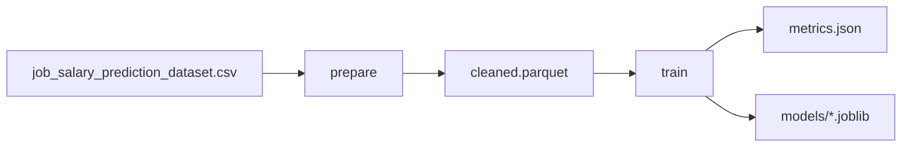

# Narzędzia w projekcie

Dokument opisuje technologie użyte w systemie, ich rolę oraz sposób uruchomienia z poziomu aplikacji lub linii poleceń.

## Azure Data Lake (ADLS Gen2)

**Rola:** Przechowywanie plików w układzie medallion (`raw`, `silver`, `gold`) oraz folderze artefaktów DVC.

**Dostęp w projekcie:** Moduł `src/etl/lake_io.py`, konfiguracja w `.env`.

**Uruchomienie operacji:**

- Portal: `/docs/etl` → przygotowanie z zapisem do lake.
- CLI: `python scripts/run.py prepare` (bez `--local-only`).
- Weryfikacja: `python scripts/verify.py --azure`.

## Azure SQL Database

**Rola:** Hurtownia danych w schemacie gwiazdy (`dim_*`, `fact_salaries`) pod dashboard i zapytania analityczne.

**Dostęp:** `src/etl/load_dwh.py`.

**Uruchomienie:**

- Portal: `/docs/etl` → załaduj hurtownię SQL.
- CLI: `python scripts/run.py load-dwh`.
- Weryfikacja: `python scripts/verify.py --sql`.

## Prefect

**Rola:** Orkiestracja pipeline ETL, rejestracja przebiegów, harmonogram tygodniowy.

**Flow `etl_main`:**

1. Weryfikacja pliku raw.
2. Czyszczenie → silver.
3. Agregaty gold.
4. Ładowanie schematu gwiazdy do SQL (opcjonalnie).

**Uruchomienie:**

```powershell
python scripts/run.py etl
python scripts/run.py etl --serve
```

W Dockerze serwer Prefect startuje automatycznie; historia w `./data/prefect`.

**Flow `monitor_and_retrain`:** harmonogram sprawdzania driftu i retreningu (niedziela 04:30), aktywny retrening gdy `monitoring.auto_retrain_enabled: true`.

```powershell
python -m src.monitoring.flows --serve
```

Interfejs: http://localhost:4200

## MLflow

**Rola:** Śledzenie eksperymentów treningowych — parametry, metryki (RMSE, MAE, R²), rejestr modelu `JobSalaryPredictor`.

**Lokalizacja danych:** `data/mlflow/mlflow.db` (SQLite).

**Uruchomienie UI:**

```powershell
python scripts/run.py mlflow-ui
```

W Dockerze: http://localhost:5000

**Weryfikacja:** `python scripts/verify.py --mlflow`

**Reset:** `python scripts/reset_mlflow.py`

## DVC (Data Version Control)

**Rola:** Powtarzalny pipeline od CSV do modelu; synchronizacja dużych plików z remote Azure (`dvc-artifacts/`).

**Definicja:** `dvc.yaml` — etapy `prepare` i `train`.



**Uruchomienie:**

```powershell
python scripts/verify.py --dvc
python scripts/run.py dvc --fast
dvc metrics show
dvc pull
dvc push
```

Portal: `/docs/dvc`.

**Uwaga:** MLflow i DVC są komplementarne — DVC wersjonuje pliki wynikowe pipeline, MLflow rejestruje eksperymenty i metryki treningu.

## XGBoost i scikit-learn

**Rola:** Model regresji przewidujący pensję; preprocessor (kodowanie kategorii, skalowanie) w pipeline sklearn.

**Kod:** `src/train/train_model.py`, `src/train/features.py`.

**Uruchomienie treningu:**

- Portal: `/docs/training`.
- CLI: `python scripts/run.py train [--no-tune]`.
- DVC: `python scripts/run.py dvc --fast`.

Wyjście: `models/preprocessor.joblib`, `models/xgboost_model.joblib`, `training_baseline.parquet`.

## Evidently

**Rola:** Raporty driftu danych — porównanie rozkładów cech i pensji między baseline treningu a bieżącym silver.

**Kod:** `src/monitoring/evidently_report.py`, `src/monitoring/drift_simulate.py`.

**Uruchomienie:**

- Portal: `/monitoring`.
- CLI symulacji: `python scripts/simulate_drift.py --scenario salary_market_up --count 5000`.

Wyjście: `reports/drift_report_*.html`, `data/processed/drift_metrics.json`.

**Logika porównania:**

| Strona | Plik |
|--------|------|
| Referencja | `training_baseline.parquet` |
| Bieżący rynek | `cleaned.parquet` lub symulacja |

Prog driftu: `monitoring.drift_threshold` w `params.yaml` (domyślnie 0.5 udziału kolumn ze driftem).

## FastAPI

**Rola:** Jedna aplikacja łącząca portal HTML, API REST i endpointy operacji (`/api/jobs`).

**Uruchomienie:**

```powershell
python scripts/run.py app --serve
docker compose up --build
```

**Testy:** `python scripts/test.py --suite api`

Dokumentacja OpenAPI: `/docs` na hoście aplikacji.

## Docker

**Rola:** Standaryzowane środowisko produkcyjne — portal, MLflow i Prefect w jednym kontenerze.

**Pliki:** `Dockerfile`, `docker-compose.yml`, `docker/entrypoint.sh`.

Przy starcie kontenera:

- synchronizacja modeli DVC (`docker/sync_dvc_models.py`),
- start Prefect Server w tle,
- start MLflow UI (gdy istnieje baza),
- start uvicorn (portal).

## Podsumowanie — które narzędzie do jakiego zadania

| Zadanie | Narzędzie |
|---------|-----------|
| Przechowywanie plików surowych i przetworzonych | Azure Data Lake |
| Tabele pod raporty SQL | Azure SQL |
| Harmonogram ETL | Prefect |
| Eksperymenty ML | MLflow |
| Wersjonowanie modeli i parquet | DVC |
| Prognoza pensji | XGBoost (via FastAPI) |
| Wykrywanie zmian danych | Evidently |
| Interfejs użytkownika | FastAPI + Docker |

Powiązane: [user-web.md](user-web.md), [user-cli.md](user-cli.md), [configuration.md](configuration.md).
