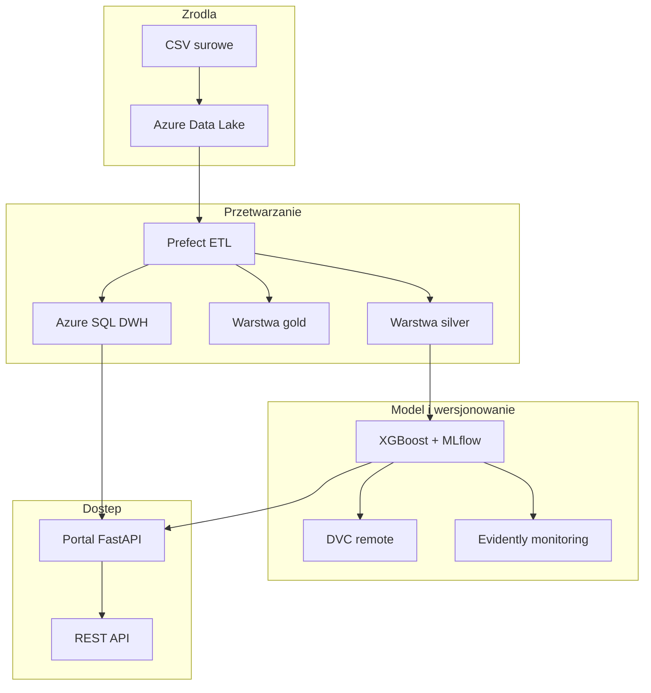

# Prognoza wynagrodzeń — system analityczny (HdProjekt)

System wspiera szacowanie rynkowej pensji na podstawie cech oferty pracy. Łączy hurtownię danych w chmurze Microsoft Azure, pipeline przetwarzania danych, model regresji **XGBoost**, aplikację webową **FastAPI** oraz narzędzia utrzymania modelu (MLflow, DVC, Prefect, Evidently).

## O portalu (Dashboardzie)

Główny portal aplikacyjny (dostępny domyślnie pod `http://localhost:8080` w Dockerze lub `http://localhost:8000` lokalnie) stanowi zintegrowane centrum sterowania i monitoringu:
- **Dashboard analityczny**: Wizualizuje rozkłady i średnie roczne zarobki brutto (w USD) w podziale na 8 różnych przekrojów rynkowych na dynamicznych wykresach Chart.js.
- **Moduł prognozy (Inference)**: Umożliwia natychmiastowe szacowanie płac na bazie 9 cech wejściowych z walidacją Pydantic i wykrywaniem wartości nietypowych.
- **Zarządzanie zadaniami (Jobs)**: Umożliwia ręczne uruchamianie oraz podgląd statusu/logów procesów w tle (czyszczenie ETL, ładowanie hurtowni DWH, szybki i pełny trening modelu).
- **Monitoring MLOps**: Monitoruje poziom dryfu danych i dryfu celu (Evidently) w odniesieniu do bazy treningowej wraz z listą historycznych raportów HTML.
- **Integracja zewnętrzna**: Zapewnia wygodne odnośniki i przekierowania do serwera MLflow, panelu Prefect oraz Swagger UI REST API.

## Problem biznesowy

Organizacje i analitycy rynku pracy potrzebują szybkiego oszacowania wynagrodzenia przy tworzeniu ofert, negocjacjach i raportach. Ręczne porównywanie tysięcy ogłoszeń jest czasochłonne. System automatyzuje ten proces: dane ofert trafiają do hurtowni, model uczy się zależności między cechami a pensją, a wynik jest dostępny przez interfejs webowy i API.

## Źródło danych

### Zbiór

| Element | Wartość |
|---------|---------|
| Nazwa | Job Salary Prediction Dataset |
| Źródło | [Kaggle — nalisha/job-salary-prediction-dataset](https://www.kaggle.com/datasets/nalisha/job-salary-prediction-dataset) |
| Autor zbioru | [nalisha](https://www.kaggle.com/nalisha) |
| Format | CSV |
| Skala | ok. 250 000 wierszy (ofert / rekordów) |
| Licencja | Warunki użycia według strony zbioru na Kaggle (osobno od licencji kodu w repozytorium) |

### Opis

Zbiór zawiera syntetyczne rekordy ofert pracy z cechami opisującymi stanowisko, doświadczenie, branżę, lokalizację i formę zatrudnienia oraz zmienną docelową — roczne wynagrodzenie (`salary`). W projekcie służy jako:

- surowe wejście pipeline ETL (warstwa `raw` → `silver` → `gold`),
- źródło tabel hurtowni Azure SQL,
- dane treningowe modelu regresji XGBoost.

Zbiór nie zawiera daty publikacji oferty; w hurtowni wymiar czasu jest uzupełniany datą partycji ETL.

### Kolumny

| Kolumna | Typ | Rola w projekcie |
|---------|-----|------------------|
| `job_title` | tekst | cecha / wymiar stanowiska |
| `experience_years` | liczba | cecha |
| `education_level` | tekst | cecha |
| `skills_count` | liczba | cecha |
| `industry` | tekst | cecha / wymiar branży |
| `company_size` | tekst | cecha / wymiar firmy |
| `location` | tekst | cecha |
| `remote_work` | tekst | cecha |
| `certifications` | liczba | cecha |
| `salary` | liczba | **zmienna docelowa** (prognoza) |

Mapowanie kolumn: [`src/etl/schema_mapping.yaml`](src/etl/schema_mapping.yaml).

### Pobranie i lokalizacja w systemie

1. Pobrać plik ręcznie z Kaggle (wymagane konto; przycisk **Download** na stronie zbioru).
2. Zapisać jako `job_salary_prediction_dataset.csv` w katalogu głównym projektu **lub** wgrać do Azure Data Lake.

| Lokalizacja | Ścieżka |
|-------------|---------|
| Lokalnie (dev) | `job_salary_prediction_dataset.csv` |
| Azure Data Lake | `raw/job_salary_prediction_dataset.csv` |

Plik CSV **nie jest** commitowany do Git (`.gitignore`). Alternatywa bez lokalnego CSV: `dvc pull` (warstwa silver / modele po wcześniejszym `dvc push` w zespole).

## Architektura



### Przepływ danych (medallion)

1. **raw** — surowy plik CSV w Data Lake.
2. **silver** — oczyszczone dane (`cleaned.parquet`).
3. **gold** — agregaty analityczne (np. średnie pensje wg lokalizacji).
4. **Azure SQL** — schemat gwiazdy pod dashboard i zapytania SQL.

### Komponenty systemu

| Komponent | Rola | Dostęp |
|-----------|------|--------|
| Portal FastAPI | Dashboard, operacje pipeline, prognoza, monitoring | http://localhost:8080 (Docker) |
| REST API | `POST /predict`, `GET /health` | ten sam host co portal |
| MLflow | Rejestr eksperymentów i metryk modelu | http://localhost:5000 |
| Prefect | Orkiestracja i harmonogram ETL | http://localhost:4200 |
| DVC | Wersjonowanie artefaktów ML w Azure | CLI / portal `/docs/dvc` |
| Evidently | Raporty driftu danych | portal `/monitoring` |

## Interfejs

### Aplikacja webowa

| Ścieżka | Funkcja |
|---------|---------|
| `/` | Strona główna z nawigacją |
| `/dashboard` | Wykresy z hurtowni lub danych lokalnych |
| `/predict` | Formularz prognozy pensji |
| `/monitoring` | Drift danych, symulacja, retrening |
| `/docs/etl` | Przygotowanie danych, ETL, ładowanie SQL |
| `/docs/training` | Trening modelu |
| `/docs/dvc` | Pipeline DVC |
| `/mlflow` | Przekierowanie do MLflow UI |

### Dashboard analityczny

Interaktywny panel (dostępny pod `/dashboard`) prezentuje kluczowe statystyki rynkowe na responsywnych wykresach Chart.js:
- **Karty KPI**: liczba ofert w silver, średnia i mediana rocznych zarobków w USD brutto oraz status źródła danych (Silver Parquet / Azure SQL DWH).
- **Rozkład i przekroje**: rozkład pensji (histogram), średnie zarobki wg lokalizacji (top 10), branży, formy pracy (zdalna/stacjonarna), wielkości firmy, poziomu wykształcenia oraz doświadczenia.
- **Optymalizacja**: wykresy dynamicznie dostosowują się do rozmiaru kart (Flexbox + wrappers), a przycisk odświeżania omija pamięć podręczną przeglądarki za pomocą timestamp cache-bustera.

### API REST

| Metoda | Ścieżka | Opis |
|--------|---------|------|
| GET | `/health` | Status serwisu i dostępność modelu |
| POST | `/predict` | Prognoza pensji (JSON) |
| GET | `/docs` | Dokumentacja OpenAPI (Swagger) |
| GET | `/api/dashboard` | Dane wykresów (JSON) |
| POST | `/api/jobs` | Uruchomienie zadania w tle |

Szczegóły: [docs/user-web.md](docs/user-web.md).

## Konfiguracja

Wymagany plik `.env` (wzór: `.env.example`) z danymi Azure Storage i Azure SQL. Parametry modelu i monitoringu: `params.yaml`.

Pełny opis: [docs/configuration.md](docs/configuration.md).

## Wymagania wstępne

- Python 3.11 lub nowszy
- Docker i Docker Compose (ścieżka produkcyjna)
- [ODBC Driver 18 for SQL Server](https://learn.microsoft.com/en-us/sql/connect/odbc/download-odbc-driver-for-sql-server) (ładowanie hurtowni z maszyny lokalnej)
- Konto Azure: Storage Account (ADLS Gen2) + Azure SQL Database

## Szybka instalacja

### Produkcja (Docker)

```powershell
git clone <url-repozytorium>
cd HdProjekt
copy .env.example .env
# Uzupełnienie zmiennych Azure w .env
# CSV: skopiuj do input/job_salary_prediction_dataset.csv (zalecane w Docker)
#      lub do katalogu głównego; alternatywa: dvc pull / dane w Azure lake

docker compose up --build
```

Po uruchomieniu (również bez modelu — oczekiwane po świeżym klonie):

- Portal: http://localhost:8080 — ETL i trening z przeglądarki
- Prefect: http://localhost:4200
- MLflow: http://localhost:5000 — dostępne po pierwszym treningu (`data/mlflow/mlflow.db`)

Historia Prefect jest trwała dzięki wolumenowi `./data/prefect`.

### Środowisko deweloperskie

```powershell
python -m venv .venv
.\.venv\Scripts\activate
python scripts/install.py
copy .env.example .env
python scripts/verify.py --all

python scripts/run.py prepare
python scripts/run.py train --no-tune
python scripts/run.py app --serve
```

`verify.py --all` akceptuje świeży projekt (brak modelu / runów MLflow = komunikat INFO).  
`run.py app --serve` startuje portal bez modelu; prognoza po treningu.  
Weryfikacja testów: `python scripts/test.py`.

Szczegóły CLI: [docs/user-cli.md](docs/user-cli.md).

## Struktura katalogów

```
├── api/              # FastAPI: portal, REST API, testy
├── src/              # Logika: ETL, trening, monitoring, portal
├── scripts/          # install, verify, run, test
├── docker/           # Entrypoint kontenera
├── docs/             # Dokumentacja użytkownika
├── data/             # Dane lokalne (poza Git)
├── models/           # Modele produkcyjne (.joblib)
├── reports/          # Raporty HTML (Evidently)
├── params.yaml       # Parametry modelu i monitoringu
├── dvc.yaml          # Pipeline DVC
└── docker-compose.yml
```

## Dokumentacja

| Plik | Zawartość |
|------|-----------|
| [docs/configuration.md](docs/configuration.md) | Azure, `.env`, `params.yaml`, Docker |
| [docs/user-web.md](docs/user-web.md) | Instrukcja aplikacji webowej i przypadki użycia |
| [docs/user-cli.md](docs/user-cli.md) | Instrukcja linii poleceń i przypadki użycia |
| [docs/tools.md](docs/tools.md) | Opis narzędzi i sposób użycia w projekcie |
| [docs/presentation.md](docs/presentation.md) | Propozycja prezentacji systemu |

## Autorzy

Zespół projektowy — TURTLE TEAM WNSiT US.
