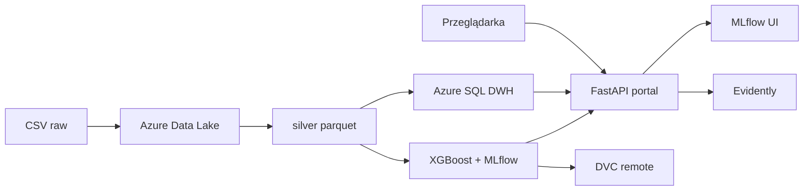

# Prognoza wynagrodzeń — system analityczny (HdProjekt)

Projekt zespołowy na przedmiot **Hurtownie danych i analityczne metody przetwarzania** ([materiały kursu](https://hd-us.netlify.app/), [wymagania zaliczenia](https://hd-us.netlify.app/00-organizacja)).

## Problem biznesowy

Rynek pracy wymaga szybkiego oszacowania pensji na podstawie cech oferty (stanowisko, doświadczenie, branża, lokalizacja, model pracy zdalnej). System łączy hurtownię danych w chmurze, pipeline ETL, model **XGBoost**, **jedną aplikację webową FastAPI** (dashboard, prognoza, nawigacja do MLflow/DVC) oraz MLOps (DVC, monitoring, CI/CD) — pod ocenę **bdb**. **Bez Streamlit** — produkcja przez **Docker**.

## Źródło danych

| Pole | Wartość |
|------|---------|
| Zbiór | [Job Salary Prediction Dataset](https://www.kaggle.com/datasets/nalisha/job-salary-prediction-dataset) (Kaggle / autor: nalisha) |
| Pobranie | **Ręczne** (plik CSV w projekcie i w Azure Data Lake `raw/`) |
| Lokalnie | `job_salary_prediction_dataset.csv` (nie w Git — patrz `.gitignore`) |
| W lake | `raw/job_salary_prediction_dataset.csv` |

Kolumny: `job_title`, `experience_years`, `education_level`, `skills_count`, `industry`, `company_size`, `location`, `remote_work`, `certifications`, `salary`.

## Architektura



- **Medallion:** `raw/` → `silver/` → `gold/`
- **Hurtownia:** schemat gwiazdy w Azure SQL
- **ML:** XGBoost, eksperymenty w **lokalnym MLflow** (`data/mlflow/`)
- **Wersjonowanie artefaktów:** DVC → Azure (`dvc-artifacts/`)

## Wymagania wstępne

- Python 3.11+
- [ODBC Driver 18 for SQL Server](https://learn.microsoft.com/en-us/sql/connect/odbc/download-odbc-driver-for-sql-server)
- Konto Azure: Storage Account (ADLS Gen2) + Azure SQL Database
- Instrukcja konfiguracji Azure: [docs/azure-setup.md](docs/azure-setup.md)

## Szybki start (produkcja / demo) — Docker

Docelowy punkt wejścia dla użytkownika zewnętrznego (plan fazy 7):

```powershell
git clone <url-repozytorium>
cd HdProjekt
copy .env.example .env
# Uzupełnij .env (Azure). Przygotuj CSV lub: dvc pull

docker compose up --build
# Przeglądarka: http://localhost:8080  — portal (dashboard, prognoza, linki do MLflow)
```

Plan portalu: [docs/portal-docker.md](docs/portal-docker.md) · szczegóły: `.cursor/plans/projekt_hd_bdb_5389cdd2.plan.md`

## Szybki start (development — skrypty)

Skrypty są dla zespołu deweloperskiego i CI; nie wymagane przy ścieżce Docker.

```powershell
python -m venv .venv
.\.venv\Scripts\activate
pip install -r requirements.txt
copy .env.example .env

python scripts/setup_azure_check.py
python scripts/setup_dvc_remote.py
python scripts/run_phase1.py
python scripts/run_phase2.py
python scripts/run_phase3.py
python scripts/run_phase4.py
python scripts/run_phase5.py --fast
python scripts/run_phase6.py --serve   # REST API :8000
python scripts/run_phase7.py           # portal web (dashboard, prognoza, docs)
python scripts/run_mlflow_ui.py        # MLflow :5000
```

DVC: [docs/dvc-pipeline.md](docs/dvc-pipeline.md) · portal/Docker: [docs/portal-docker.md](docs/portal-docker.md) · API: [docs/api.md](docs/api.md) · Prefect: [docs/prefect-etl.md](docs/prefect-etl.md)

## Struktura katalogów

```
├── src/           # logika (config, etl, cleaning, train, monitoring)
├── scripts/       # setup Azure, DVC
├── docs/          # azure-setup.md
├── data/          # cache lokalny (puste w Git)
├── api/           # FastAPI: API + portal web (faza 7)
├── docker/        # entrypoint, nginx (faza 7)
├── requirements.txt
└── .env.example
```

Szczegółowy plan faz: `.cursor/plans/projekt_hd_bdb_5389cdd2.plan.md`.

## Rozszerzenia (poza zakresem zaliczenia)

Po ukończeniu projektu możesz **bez zmiany kodu biznesowego** przetestować:

- **Azure ML Workspace** jako backend MLflow — ustaw `MLFLOW_TRACKING_URI` na URI workspace i zarejestruj model w Azure ML Model Registry.
- Harmonogram retrainingu wyłącznie w Prefect (`serve` + cron) zamiast lub obok GitHub Actions.

## Checklist ocena **bdb**

| Element | Status | Dowód (po implementacji) |
|---------|--------|---------------------------|
| Repozytorium Git + README | częściowo | ten plik |
| Azure SQL + dashboard | tak | portal `/dashboard`, `src/etl/load_dwh.py` |
| Pipeline ETL (Prefect) | planowane | `src/etl/flows.py` |
| Model + ewaluacja | planowane | XGBoost + MLflow |
| MLflow + DVC + API + portal | tak | `data/mlflow/`, `dvc.yaml`, `api/`, `docker compose` |
| Monitoring (Evidently) | planowane | `src/monitoring/` |
| CI/CD lub retraining | planowane | `.github/workflows/` lub Prefect cron |

## Autorzy

Zespół projektowy — WNSiT US.
