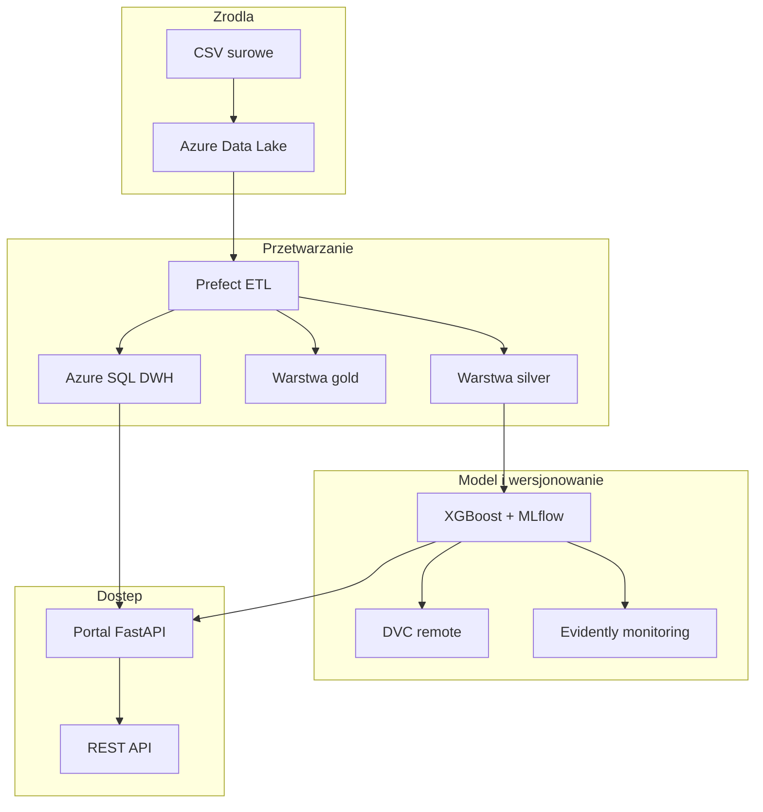

# Prognoza wynagrodzeń — system analityczny (HdProjekt)

System wspiera szacowanie rynkowej pensji na podstawie cech oferty pracy. Łączy hurtownię danych w chmurze Microsoft Azure, pipeline przetwarzania danych, model regresji **XGBoost**, aplikację webową **FastAPI** oraz narzędzia utrzymania modelu (MLflow, DVC, Prefect, Evidently).

## Problem biznesowy

Organizacje i analitycy rynku pracy potrzebują szybkiego oszacowania wynagrodzenia przy tworzeniu ofert, negocjacjach i raportach. Ręczne porównywanie tysięcy ogłoszeń jest czasochłonne. System automatyzuje ten proces: dane ofert trafiają do hurtowni, model uczy się zależności między cechami a pensją, a wynik jest dostępny przez interfejs webowy i API.

## Źródło danych

| Element | Opis |
|---------|------|
| Zbiór | [Job Salary Prediction Dataset](https://www.kaggle.com/datasets/nalisha/job-salary-prediction-dataset) (Kaggle) |
| Pobranie | Ręczne — plik CSV nie jest przechowywany w repozytorium Git |
| Lokalnie | `job_salary_prediction_dataset.csv` w katalogu projektu |
| W chmurze | `raw/job_salary_prediction_dataset.csv` w Azure Data Lake |

Kolumny wejściowe: `job_title`, `experience_years`, `education_level`, `skills_count`, `industry`, `company_size`, `location`, `remote_work`, `certifications`. Kolumna docelowa: `salary`.

## Architektura



### Przepływ danych (medallion)

1. **raw** — surowy plik CSV w Data Lake.
2. **silver** — oczyszczone dane (`cleaned.parquet`).
3. **gold** — agregaty analityczne (np. średnie pensje wg lokalizacji).
4. **Azure SQL** — schemat gwiazdy pod dashboard i zapytania SQL.

### Komponenty systemu

| Komponent | Rola | Dostęp |
|-----------|------|--------|
| Portal FastAPI | Dashboard, operacje pipeline, prognoza, monitoring | http://localhost:8080 (Docker) |
| REST API | `POST /predict`, `GET /health` | ten sam host co portal |
| MLflow | Rejestr eksperymentów i metryk modelu | http://localhost:5000 |
| Prefect | Orkiestracja i harmonogram ETL | http://localhost:4200 |
| DVC | Wersjonowanie artefaktów ML w Azure | CLI / portal `/docs/dvc` |
| Evidently | Raporty driftu danych | portal `/monitoring` |

## Interfejs

### Aplikacja webowa

| Ścieżka | Funkcja |
|---------|---------|
| `/` | Strona główna z nawigacją |
| `/dashboard` | Wykresy z hurtowni lub danych lokalnych |
| `/predict` | Formularz prognozy pensji |
| `/monitoring` | Drift danych, symulacja, retrening |
| `/docs/etl` | Przygotowanie danych, ETL, ładowanie SQL |
| `/docs/training` | Trening modelu |
| `/docs/dvc` | Pipeline DVC |
| `/mlflow` | Przekierowanie do MLflow UI |

### API REST

| Metoda | Ścieżka | Opis |
|--------|---------|------|
| GET | `/health` | Status serwisu i dostępność modelu |
| POST | `/predict` | Prognoza pensji (JSON) |
| GET | `/docs` | Dokumentacja OpenAPI (Swagger) |
| GET | `/api/dashboard` | Dane wykresów (JSON) |
| POST | `/api/jobs` | Uruchomienie zadania w tle |

Szczegóły: [docs/user-web.md](docs/user-web.md).

## Konfiguracja

Wymagany plik `.env` (wzór: `.env.example`) z danymi Azure Storage i Azure SQL. Parametry modelu i monitoringu: `params.yaml`.

Pełny opis: [docs/configuration.md](docs/configuration.md).

## Wymagania wstępne

- Python 3.11 lub nowszy
- Docker i Docker Compose (ścieżka produkcyjna)
- [ODBC Driver 18 for SQL Server](https://learn.microsoft.com/en-us/sql/connect/odbc/download-odbc-driver-for-sql-server) (ładowanie hurtowni z maszyny lokalnej)
- Konto Azure: Storage Account (ADLS Gen2) + Azure SQL Database

## Szybka instalacja

### Produkcja (Docker)

```powershell
git clone <url-repozytorium>
cd HdProjekt
copy .env.example .env
# Uzupełnienie zmiennych Azure w .env
# Przygotowanie CSV lub: dvc pull

docker compose up --build
```

Po uruchomieniu:

- Portal: http://localhost:8080
- MLflow: http://localhost:5000
- Prefect: http://localhost:4200

Historia Prefect jest trwała dzięki wolumenowi `./data/prefect`.

### Środowisko deweloperskie

```powershell
python -m venv .venv
.\.venv\Scripts\activate
python scripts/install.py
copy .env.example .env
python scripts/verify.py --all

python scripts/run.py prepare
python scripts/run.py load-dwh
python scripts/run.py dvc --fast
python scripts/run.py app --serve
```

Weryfikacja testów: `python scripts/test.py`.

Szczegóły CLI: [docs/user-cli.md](docs/user-cli.md).

## Struktura katalogów

```
├── api/              # FastAPI: portal, REST API, testy
├── src/              # Logika: ETL, trening, monitoring, portal
├── scripts/          # install, verify, run, test
├── docker/           # Entrypoint kontenera
├── docs/             # Dokumentacja użytkownika
├── data/             # Dane lokalne (poza Git)
├── models/           # Modele produkcyjne (.joblib)
├── reports/          # Raporty HTML (Evidently)
├── params.yaml       # Parametry modelu i monitoringu
├── dvc.yaml          # Pipeline DVC
└── docker-compose.yml
```

## Dokumentacja

| Plik | Zawartość |
|------|-----------|
| [docs/configuration.md](docs/configuration.md) | Azure, `.env`, `params.yaml`, Docker |
| [docs/user-web.md](docs/user-web.md) | Instrukcja aplikacji webowej i przypadki użycia |
| [docs/user-cli.md](docs/user-cli.md) | Instrukcja linii poleceń i przypadki użycia |
| [docs/tools.md](docs/tools.md) | Opis narzędzi i sposób użycia w projekcie |
| [docs/presentation.md](docs/presentation.md) | Propozycja prezentacji systemu |

## Autorzy

Zespół projektowy — WNSiT US.
